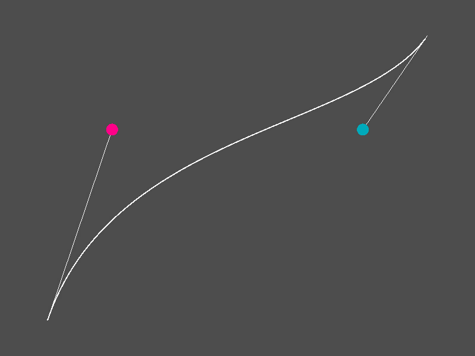

# Cubic Bézier Controls
Godot addon with a Cubic Bézier Curve Resource and Controls for visualizing and
editing them.

Curves start and end points are fixed to (0, 0) and (1, 1), storing only the
two control points. Editor Control have one handle for each control point,
similar to [https://cubic-bezier.com](https://cubic-bezier.com).

Predefined curves for common easing functions are also available, with values
taken from [https://easings.net/](https://easings.net/).

